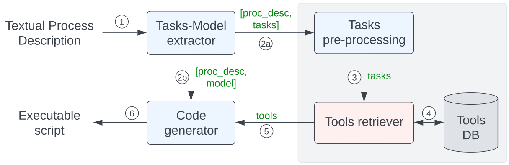

# NL2ProcessOps

## About

NL2ProcessOps is an approach based on *Large Language Models (LLMs)* able to work with textual process descriptions and to support the generation of the different operations of process deployment, from extracting the control flow in terms of a process model, over retrieving required tools (e.g., services) associated with each task, to generating executable code for manual refinement purposes and deployment in PEEs. In particular, we propose a pipeline that is able to generate an executable script representing the process (*process script*) that a designer can easily edit, in order to deploy the process into the PEE. The proposed approach is quantitatively and qualitatively evaluated through human and automated assessments, showing improvements over GitHub Copilot, a state-of-the-art LLM-based tool.

#### Architecture and pipeline



The Figure shows the components of NL2ProcessOps and how they interact. The numbers in the circles represent the order of the performed operations, whereas the LLM-based components are colored in light blue.

NL2ProcessOps is broken down into multiple LLMs-supported *stages* chained together: *(i)* extraction of the tasks and the control flow from the textual process description, *(ii)* retrieving of the relevant tools corresponding to the extracted tasks and *(iii)* generation of the process script representing the process. 

The stage *(i)* consists of a textual process description that is given as input (1) to the [Tasks-Model extractor](src/TasksModelLLM.py). This component is an LLM prompted to extract the tasks and the control flow of the process and generates the model representation as a Mermaid.js. The list of tasks paired with the textual process description (i.e., `[proc_desc, tasks]`) is given as input (2a) to the [Tasks pre-processing](src/TasksPreProcessingLLM) component. Concurrently, the process model and the textual process description (i.e., `[proc_desc, model]`) are given as input (2b) to the [Code generator](src/CodeLLM.py) component. Stage *(ii)* (in gray in Figure) is inspired by the RAG concept to retrieve the relevant tools for the particular textual process description. The \emph{Tasks pre-processing} component leverages an LLM to refine the descriptions of the extracted tasks based on the textual process description. The refined list of tasks is then handled (3) by the [Tools retriever](src/ToolsManagerDB.py) component. The latter interacts (4) with the vector database **Tools DB** and retrieves the most similar embedded tools offering the most suitable operation for each embedded task. **Tools DB** stores vectors consisting of the embeddings of the descriptions of the tools. The list of retrieved tools is provided (5) to the [Code generator](src/CodeLLM.py) component so that stage *(iii)* of the proposed approach begins. The [Code generator](src/CodeLLM.py) LLM, from the textual process description, process model and the list of tools (and their operations) implementing the process tasks, generates (6) a Python code -- process script -- that implements the process. 

## Structure of the repository

```
.
├── eval_code           # sources for code generation evaluation
|   ├── README.md       # evaluation results of code generation
|   └── ...
├── eval_human          # sources for the human evaluation
|   ├── README.md       # evaluation results of human evaluation
|   └── ...
├── eval_retrieval      # sources for retrieval evaluation
|   ├── README.md       # evaluation results of retrieval
|   └──...
├── src                 # source code of proposed approach
|   └──...
└──...
```


## Getting Started

- Create a new [conda](https://docs.anaconda.com/free/miniconda/) environment:
    ```bash
    conda create -n pyllm python=3.10
    conda activate pyllm
    ```

- Install the dependencies:
    ```bash
    pip install -r requirements.py
    ```

- Set up an [OpenAI API key](https://platform.openai.com/overview) and create a `.env` file in the root directory containing this line:
    ```env
    OPENAI_API_KEY=<your key, should start with sk->
    ```


## Usage

- Run the LLM:
    ```bash
    cd src
    python ProcessLLM.py
    ```

- Input a textual process description. \
    **Example**: `The calibration process of cardboard production consists of continuously capturing a photo of the cardboard being produced. Each photo is analyzed to check if all the markers identified are ok. If markers are not ok, the calibration process continues. If the markers are ok, the speed of the die-cutting machine is set to 10000 RPM and the process ends.`

- The LLM will generate a `llm_process_code.py` file with the Python program representing the textual process description given as input to the LLM. \
Given the **Example**, the LLM will generate a Python program as follows.
    ```python
    from tools.camera import CaptureImage
    from tools.vision_is import CheckMarkers
    from tools.die_machine import SetSpeedDieMachine

    import numpy as np

    def calibrate_cardboard_production():
        while True:
            # Capture a photo of the cardboard
            captured_image = CaptureImage.call()
            
            # Analyze the photo to check if all markers are ok
            markers_ok = CheckMarkers.call(image=captured_image)
            
            # If markers are not ok, continue the calibration process
            if not markers_ok:
                continue
            
            # If markers are ok, set the speed of the die-cutting machine to 10000 RPM
            speed_set = SetSpeedDieMachine.call(speed=10000)
            
            # If the speed was successfully set, end the process
            if speed_set:
                break
        
        return "Calibration process completed."

    if __name__ == "__main__":
        result = calibrate_cardboard_production()
        print(result)
    ```

## Experiments

To quantitatively and qualitatively evaluate the proposed approach we performed separate assessments for the three stages, i.e., process model (and list of tasks) extraction, retrieval of appropriate tools and executable script generation. Specifically, we assess the correctness and completeness of *(i)* the retrieved tools and *(ii)* the generated Python code. We do not evaluate the process model generation stage as it is based on a related work, where the solution has already been evaluated based on quantitative and qualitative assessments.

Different methodologies are used to assess the two stages. The retrieval stage is quantitatively evaluated using a synthetic dataset (generated with an LLM) containing pairs of textual process descriptions (the semantics of which we do not care about) and the associated set of tools. The evaluation is designed to determine whether the tools retrieved for a specific process are appropriate. The code generation stage is both quantitatively and qualitatively evaluated. A dataset containing pairs of textual process descriptions (extracted from existing datasets) and the reference executable code is used. The process codes generated are evaluated using the CodeBLEU metric, which allows code comparison, and human assessments to determine output quality.

### Retrieval experiments

[eval_retrieval](eval_retrieval) folder contains the results of the experiments. The three strategies evaluated are: *(i)* an LLM - [TaskRAG.py](eval_retrieval/TaskRAG.py) - extracting the list of tasks from the textual process description (with few-shot prompting approach), *(ii)* an LLM - [ModTaskRAG.py](eval_retrieval/ModTaskRAG.py) -that extracts the control flow and the list of tasks from the textual process description, *(iii)* two separate LLMs - [ModTaskPreRAG.py](eval_retrieval/ModTaskPreRAG.py) - which extract the control flow and the list of tasks and then refine the description of the extracted tasks. 

The dataset of the 30 textual process descriptions with the related tools is contained in [LLMtools2process](eval_retrieval/LLMtools2process) - [processes_tools.csv](eval_retrieval/LLMtools2process/processes_tools.csv).

To replicate the experiments:
1. Run each Python file related to the different strategies.
2. They will create several `.csv` files to be moved into the [data](eval_retrieval/data) folder.
3. Display precision and recall.
    ```python
    cd eval_retrieval
    python res_values.py
    ```


### Code generation experiments

[eval_code](eval_code) folder contains the results of the experiments. It contains several folders `runX` where `X` is the number of the run: *(i)* [run1](eval_code/run1) contains results with the pre-processing component using GPT-4, *(ii)* [run2](eval_code/run2) contains results with the pre-processing component using GPT-3.5 and GPT-4, *(iii)* [run3](eval_code/run3) contains results without the pre-processing component using GPT-4, *(iv)* [run4](eval_code/run4) contains results without the pre-processing component using GPT-3.5 and GPT-4, *(v)* [run5](eval_code/run5) contains results not including the process model in the prompt for the code generation component using GPT-4, *(vi)* [copilot](eval_code/copilot) contains results of the baseline GitHub Copilot.

The dataset of the 10 textual process descriptions and related Python code used for these experiments is contained in [data](eval_code/data).

To replicate the experiments:
1. The Python file contained in each `runX` folder need to be moved into the [src](src). 
2. Then run it.
3. It will generate a `.csv` file that need to be moved back to the `runX` folder. 
4. Then organize the results in single Python script.
    ```python
    cd eval_code
    python fix_data.py
    ```
5. Finally, compute CodeBLEU results.
    ```python
    cd eval_code
    python codebleu_eval.py
    ```

[res_human](eval_code/res_human.csv) contains the results of the human evaluation. They can be displayed with
```python
cd eval_code
python human_eval.py
```

### Human evaluation

[eval_human](eval_human) contains the sources of the human evaluation: the [questionnaire](eval_human/questionnaire.pdf) and the [results](eval_human/results.csv).

Evaluation is performed comparing GitHub Copilot and NL2ProcessOps results.

## License
Distributed under the MIT License. See [LICENSE](LICENSE) for more information.