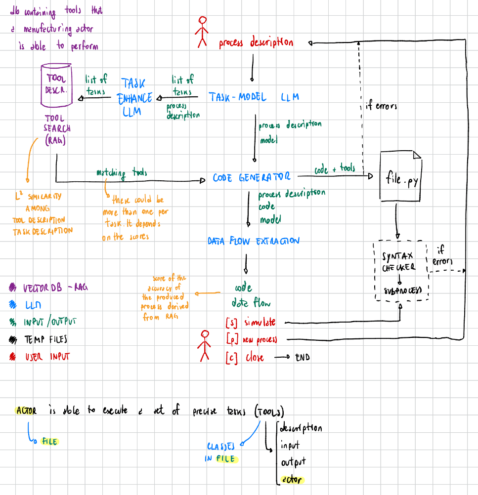

## LLM and Processes

We have four LLMs chained together to output a python code and extracting the data flow of a process description:
- `ModelTaskLLM`: extracts from the process description the list of tasks and the process model. The output of this LLM is fed to the `TaskEnhanceLLM` and to the `CodeLLM`.
- `TaskEnhanceLLM`: better summarizes the list of tasks. The output is given as input to the `ToolManager` which retrieve the matching tools able to perform given tasks. ToolManager follows **RAG** approach.
- `CodeLLM`: given the process description, the process model and the list of tools, generates a python code able to execute the process. The python code is saved into `llm_process_code.py`.
- `DataLLM`: extracts the data flow from the given process description, process model and python code.
