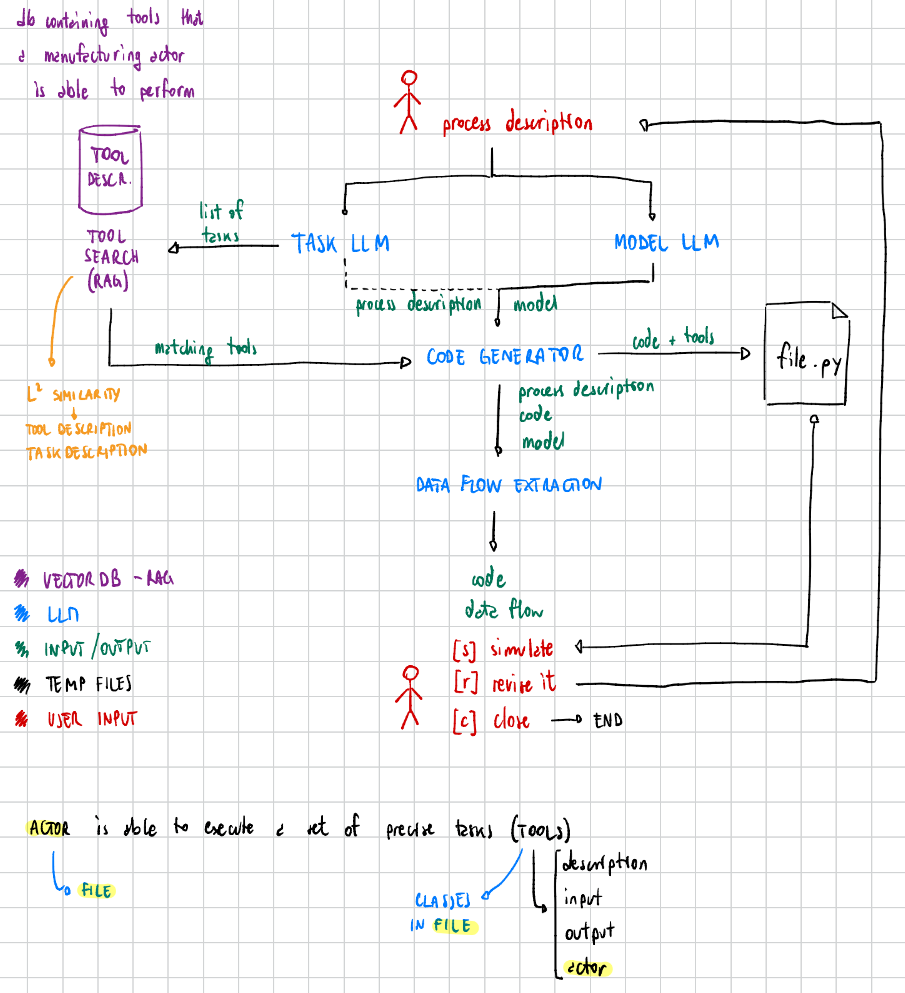

## LLM and Processes

We have four LLMs chained together to output a python code and extracting the data flow of a process description:
- TaskLLM: extracts from the process description the list of tasks. The output of this LLM is fed to the ToolManager which retrieve the matching tools able to perform given tasks. ToolManager follows RAG approach.
- ModelLLM: extract the process model from the given process description.
- CoodeLLM: given the process description, the process model and the list of tools, generate a python code able to simulate the process. The python code is saved into [process_code.py](process_code.py) for further execution.
- DataLLM: extract the data flow from the given process description, process model and python code.

### TODO
- test RAG
- find how to define tools -> UDDI, OpenAPI standard
- test with other process description